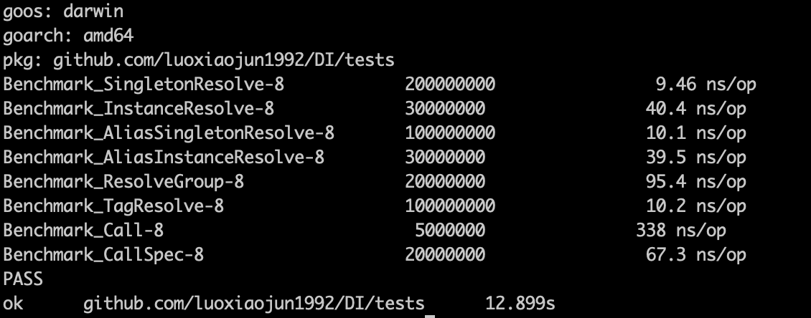

# DI
Dependency Injection in Go

# Functions
* Singleton Register
* Instance Register
* Alias Register
* Tag Register
* Resolve Single Dependency
* Resolve Grouped Dependency
* Resolve Tag Dependency
* Call function with args with dependencies

# Test Result


# Examples
```go
var container = DI.C

//Singleton Register
container.Singleton("UserService", struct {
		name string
	}{name: "hello"})
container.Resolve("UserService")

//Instance Register
container.Instance("UserService", func() interface{} {
		return struct {
			name string
		}{name: "hello"}
	})
container.Resolve("UserService")
	
//Alias Register
container.Singleton("UserService", struct {
		name string
	}{name: "hello"})
container.Alias("UserServ", "UserService")
container.Resolve("UserServ")

//Tag Register
container.Singleton("UserService", struct {
		name string
	}{name: "hello"})
container.Tag("TagDemo", &struct {
		Name interface{} `dep:"UserService"`
	}{Name: "test"})
container.Resolve("TagDemo")

//Resolve Grouped Dependency
container.Singleton("UserService", struct {
		name string
	}{name: "new user"})
container.Singleton("GoodsService", struct {
		name string
	}{name: "new goods"})
container.Singleton("OrderService", struct {
		name string
	}{name: "new order"})
container.ResolveGroup([]string{"UserService", "GoodsService", "OrderService"})

// Call function with args with dependencies
// Low performance
container.Singleton("UserService", struct {
		name string
	}{name: "hello"})
method := func(userService struct {name string}) string {return userService.name}
container.Call(method, []string{"UserService"}, []interface{}{nil})

// Call special function with args with dependencies
// High performance
container.Singleton("UserService", struct {
		name string
	}{name: "hello"})
method := func(args ...interface{}) interface{} {return args[0].(struct{name string}).name}
container.CallSpec(method, []string{"UserService"}, []interface{}{nil})
```
